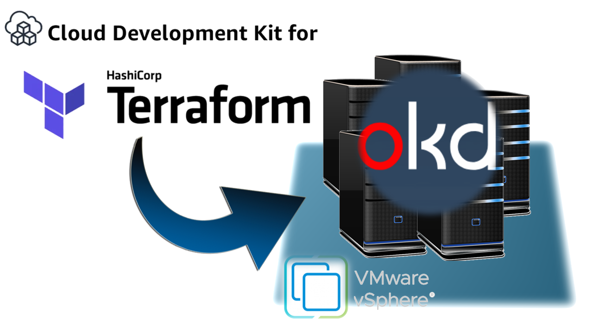
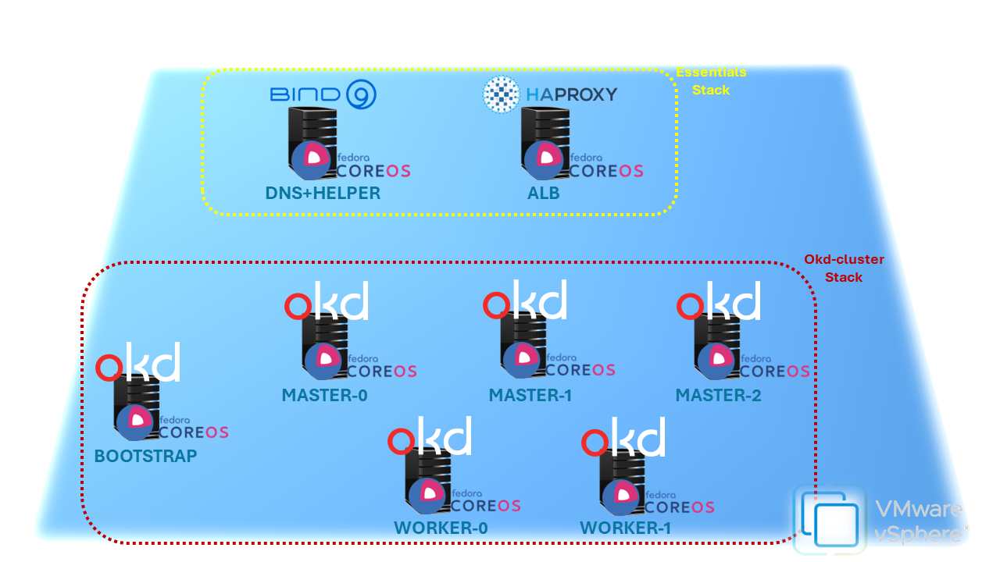

# **AUTO OKD IN VSPHERE (ANY PLATFORM SETUP)**

## **The idea**
This repo will setup an [***OKD***](https://www.okd.io) (Community edition of [RedHat Openshift](https://www.redhat.com/it/technologies/cloud-computing/openshift)) cluster in a VSphere virtualization platform WITHOUT any VSphere integration.  
Reason for that is to automatize the creation of a testing/studing environment without direct access to VSphere API.  
The automation process is built with **[CDK for Terraform](https://developer.hashicorp.com/terraform/cdktf)** following the official guide for [any platform install](https://docs.okd.io/latest/installing/installing_platform_agnostic/installing-platform-agnostic.html)

## **Usage**
To create the cluster
* Fill up the `.env` file (or export environment variable) with required setup details
* `$ npm install` to collect dependencies
* `$ npm run ignite` to generate [ignition files]() for dns and haproxy machines
* `$ npm run deploy` to start the cluster creation  

Once the creation is complete a folder `kube-auth` will be generated containing
* A private ssh key `okd-node-key` to eventually ssh into okd nodes with default sudo user **<u>core</u>**
* A `kubeconfig` file to configure your **kubectl**/**oc** utility
* A `kubeadmin-password` file containing the password for default kubernetes admin user **kubeadmin**. It can be used for console login  

To clean up the environment you can use `npm run destroy` to delete all the created infrastructure

## **The Architecture**
  
The CDK for Terraform, **cdktf**, will create in a selected ESXI hosts and datastores
* ### **The Essentials stack**  
    This Terraform stack contains
    * **DNS+HELPER VM**  
        VM running the dns server plus all required tools in order to setup the cluster (like *oc cli* or *openshift-installer* tool)
    * **ALB VM**  
        A VM achiting as reverse proxy (Ingress) for OKD cluster. As per official guide this machine runs an instance of **[haproxy](https://www.haproxy.org)**  
* ### **The OKD-CLUSTER stack**
    This Terraform stack contains
    * **BOOTSTRAP NODE**  
    Temporary node to bootstrap the cluster
    * **MASTER NODES**  
    Kubernetes/Openshift master nodes (3 vms)
    * **WORKER NODES**
    Kubernetes/Openshift worker nodes (2+ vms)